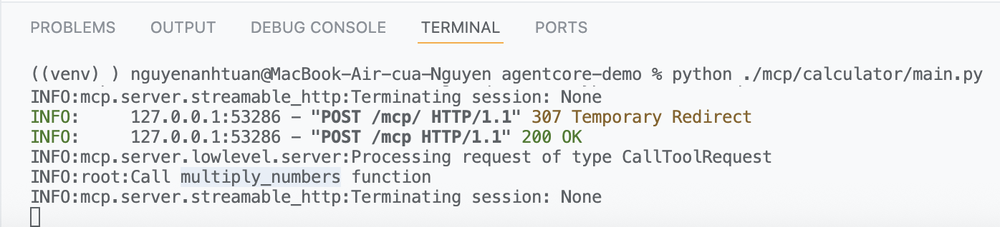
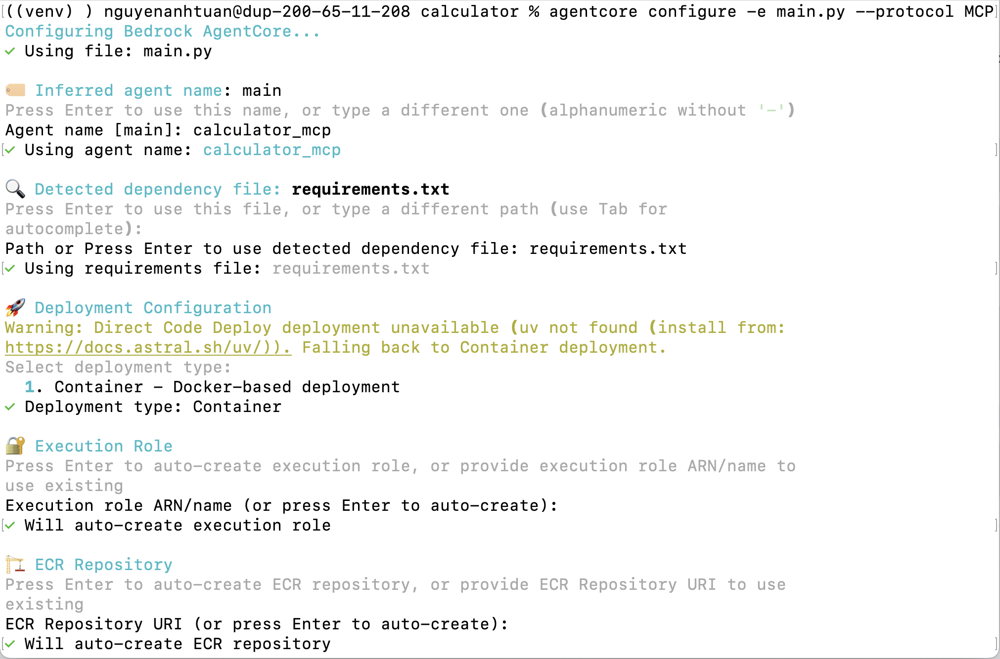
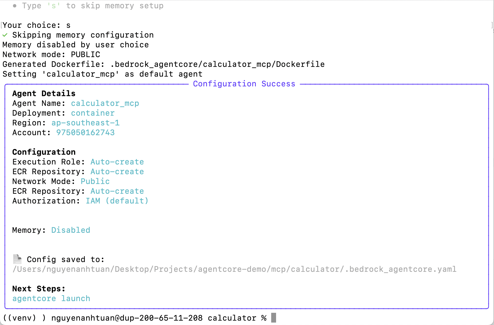
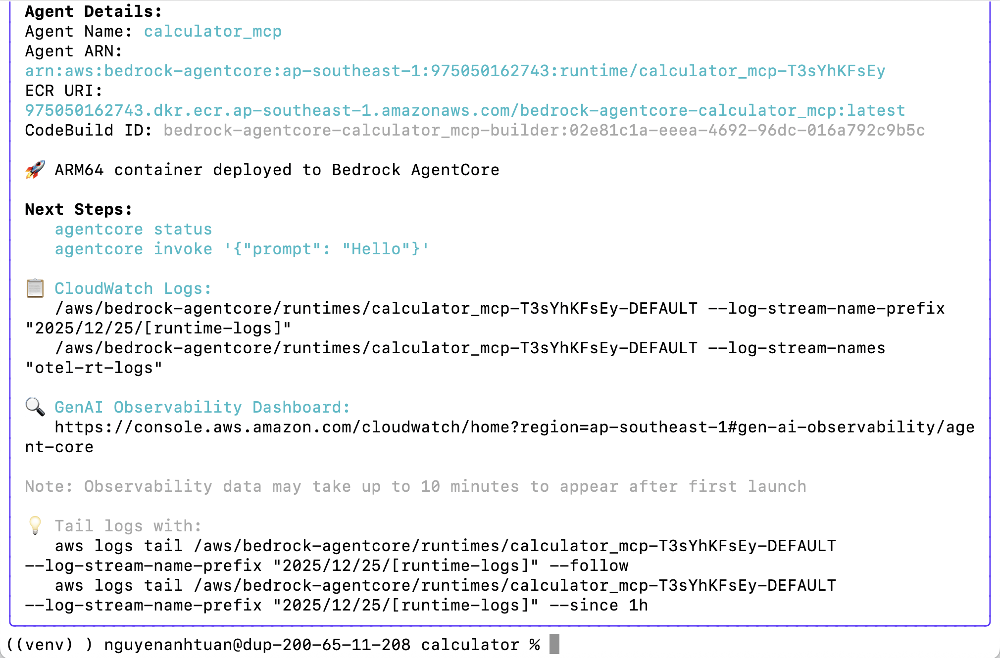
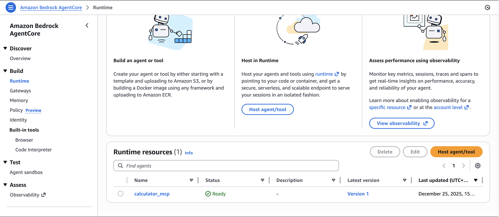
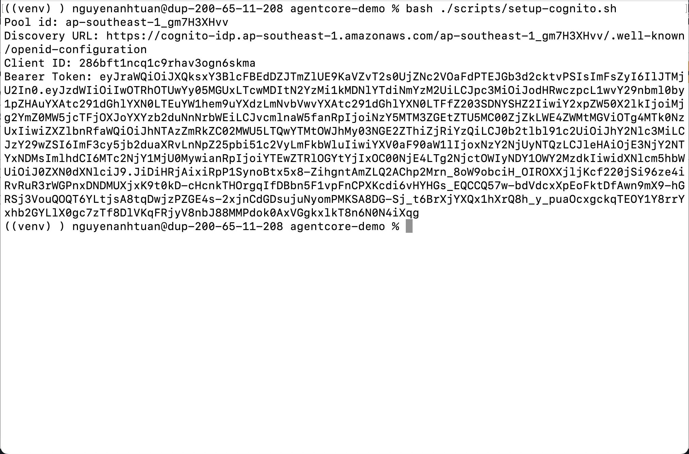
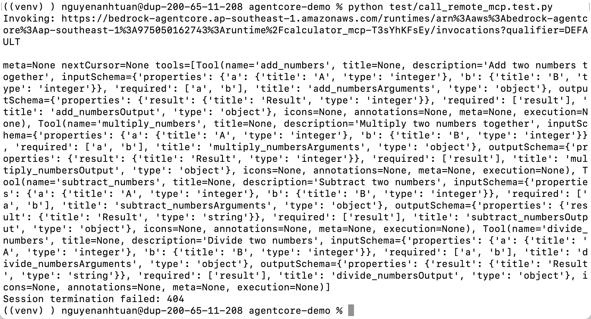
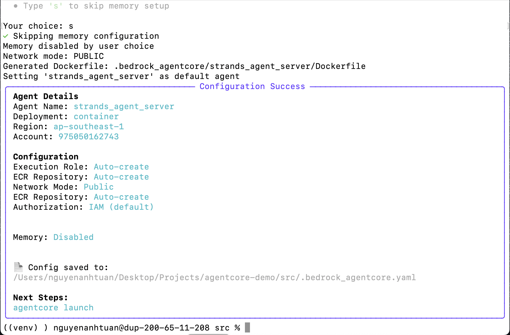
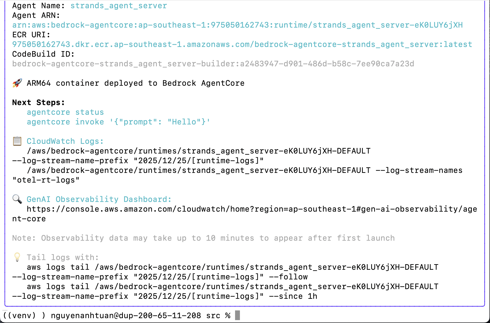
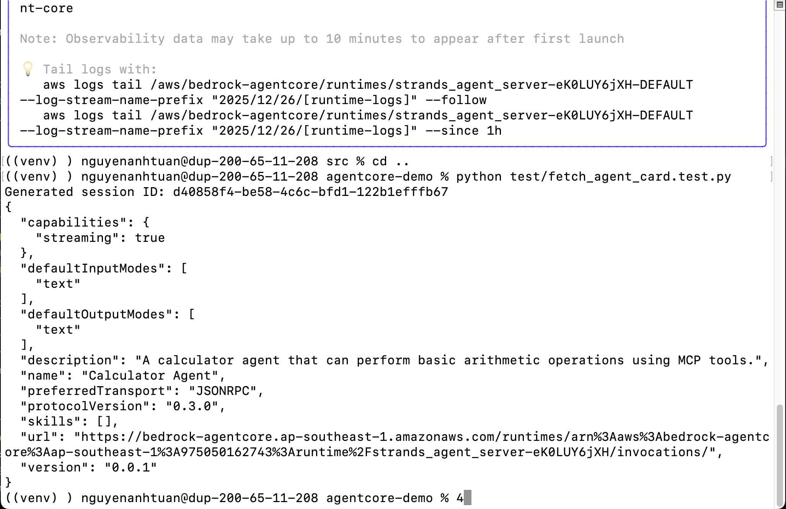

# Bedrock AgentCore Code Sample

Đây là repo code mẫu đơn giản cho AgentCore. Nên trong bài này thì mình sẽ chỉ dùng 1 Agent duy nhất.

## Requirements

Cần một số package sau để chạy:

1. Python >= 3.12
2. Các packages trong requirements.txt

## Authentication

Trong bài này thì mình có setup một số bash script để chạy đăng nhập vào Cognito User hoặc refresh các tokens. Các scripts này cần phải được chạy trước để lấy Access Token (Bearer Token) để mà có thể chạy được các python script call tới AgentCore.

- `scripts/sign-in.sh`: dùng để đăng nhập Cognito User. Trước khi chạy script này thì bạn nên gán biến môi trường trên Shell Session với lệnh `export CLIENT_ID=client_id` (thay thế client_id của bạn).
- `scripts/refresh-tokens.sh`: dùng để làm mới lại access token. Nếu như đã lâu mà bạn không thực hiện các thao tác với access token, thì nó sẽ hết liệu lực (trong vòng 1 tiếng), nên nếu như bạn muốn chạy lại các script thì phải chạy script này để lấy access token mới. Trước khi chạy script này thì bạn nên gán biến môi trường trên Shell Session với lệnh `export REFRESH_TOKEN=refresh_token` (thay thế refresh_token của bạn).

> Note: nếu như bạn có set các biến ở trong file .env bên ngoài Terminal mà bạn đang thao tác, thì nhớ unset các biến đó. Bởi vì Python Dotenv sẽ ưu tiên các biến này hơn => Các biến trong .env sẽ không được dùng.

## Installation

1. Đầu tiên thì cài môi trường ảo cho Python.

```bash
python3 -m venv venv
```

2. Sau đó là trỏ về môi trường ảo này.

```bash
source venv/bin/activate
```

3. Cài đặt các packages python cần thiết (Cài toàn bộ)

```bash
pip install -r requirements.txt
```

Nếu như bạn sử dụng Strands Agents thì chỉ cần cài

```bash
pip install ".[strands_agents]"
```

## Setup

### Setup .env file

Đầu tiên thì mình phải setup .env file trước, đây là file quan trọng để mình có thể tương tác với Agent Server trên hạ tầng của AWS.

```bash
touch .env && echo .env.example > .env
```

Mở file `.env` lên rồi điền tên AWS CLI Profile trong biến `AWS_PROFILE` tương ứng để làm bài này. Profile này sẽ được dùng xuyên suốt bài.

Giá trị của các biến còn lại thì trong bước sau mình sẽ điền vào đó.

### Setup ENV Variables

Hiện tại thì chỉ có duy nhất biến `AWS_PROFILE` phải setup trước. Biến phải được setup trong cùng 1 shell session.

```bash
echo $AWS_PROFILE
```

Nếu kết quả là rỗng thì bạn nên setup trước.

```bash
export AWS_PROFILE=profile-name
```

## Run

### On Local

1. Đầu tiên là chạy MCP Server trước.

```bash
python ./mcp/calculator/main.py
```

2. Chạy Agent Server.

```bash
python ./src/strands_agent_server.py
```

3. Thử gửi một yêu cầu tới Agent Server.

```bash
python ./test/call_strands_agent.py
```

Hoặc có thể gọi trực tiếp với curl.

```bash
curl -X POST http://localhost:9000/ \
-H "Content-Type: application/json" \
-d '{
  "jsonrpc": "2.0",
  "id": "req-001",
  "method": "message/send",
  "params": {
    "message": {
      "role": "user",
      "parts": [
        {
          "kind": "text",
          "text": "what is 101 * 11?"
        }
      ],
      "messageId": "12345678-1234-1234-1234-123456789012"
    }
  }
}' | jq .
```

Khi đó chúng ta sẽ nhận được kết quả.

```json
{
  "id": "req-001",
  "jsonrpc": "2.0",
  "result": {
    "artifacts": [
      {
        "artifactId": "3b37ca71-1100-45ba-a2ad-bd1cda4b1093",
        "name": "agent_response",
        "parts": [
          {
            "kind": "text",
            "text": "101 * 11 = 1,111\n"
          }
        ]
      }
    ],
    "contextId": "44577391-84b3-4299-b306-fdfe168bfefa",
    "history": [
      {
        "contextId": "44577391-84b3-4299-b306-fdfe168bfefa",
        "kind": "message",
        "messageId": "12345678-1234-1234-1234-123456789012",
        "parts": [
          {
            "kind": "text",
            "text": "what is 101 * 11?"
          }
        ],
        "role": "user",
        "taskId": "035508b5-3a49-492a-a41a-7f032dc9642b"
      },
      {
        "contextId": "44577391-84b3-4299-b306-fdfe168bfefa",
        "kind": "message",
        "messageId": "03ab02ba-ce3a-4851-b957-225a9d060594",
        "parts": [
          {
            "kind": "text",
            "text": "I'll calculate 101 * "
          }
        ],
        "role": "agent",
        "taskId": "035508b5-3a49-492a-a41a-7f032dc9642b"
      },
      {
        "contextId": "44577391-84b3-4299-b306-fdfe168bfefa",
        "kind": "message",
        "messageId": "a254a1ec-42f6-43d3-ac74-834ccd0a3bf2",
        "parts": [
          {
            "kind": "text",
            "text": "11 for you using"
          }
        ],
        "role": "agent",
        "taskId": "035508b5-3a49-492a-a41a-7f032dc9642b"
      },
      {
        "contextId": "44577391-84b3-4299-b306-fdfe168bfefa",
        "kind": "message",
        "messageId": "943d5bb2-9ffb-4527-988a-0ca8f1738bfb",
        "parts": [
          {
            "kind": "text",
            "text": " the multiply"
          }
        ],
        "role": "agent",
        "taskId": "035508b5-3a49-492a-a41a-7f032dc9642b"
      },
      {
        "contextId": "44577391-84b3-4299-b306-fdfe168bfefa",
        "kind": "message",
        "messageId": "53df7f25-f448-47a1-875f-d01fc0b542b8",
        "parts": [
          {
            "kind": "text",
            "text": " function"
          }
        ],
        "role": "agent",
        "taskId": "035508b5-3a49-492a-a41a-7f032dc9642b"
      },
      {
        "contextId": "44577391-84b3-4299-b306-fdfe168bfefa",
        "kind": "message",
        "messageId": "7170d45b-fd2c-4743-a27b-8c3a2001b8fa",
        "parts": [
          {
            "kind": "text",
            "text": "."
          }
        ],
        "role": "agent",
        "taskId": "035508b5-3a49-492a-a41a-7f032dc9642b"
      },
      {
        "contextId": "44577391-84b3-4299-b306-fdfe168bfefa",
        "kind": "message",
        "messageId": "1bc9ef32-793d-4543-9537-35c85905bc1e",
        "parts": [
          {
            "kind": "text",
            "text": "101"
          }
        ],
        "role": "agent",
        "taskId": "035508b5-3a49-492a-a41a-7f032dc9642b"
      },
      {
        "contextId": "44577391-84b3-4299-b306-fdfe168bfefa",
        "kind": "message",
        "messageId": "130d8b42-799c-4d98-be9d-bf288e49e418",
        "parts": [
          {
            "kind": "text",
            "text": " * 11 = 1"
          }
        ],
        "role": "agent",
        "taskId": "035508b5-3a49-492a-a41a-7f032dc9642b"
      },
      {
        "contextId": "44577391-84b3-4299-b306-fdfe168bfefa",
        "kind": "message",
        "messageId": "af51f02a-98de-4882-bb80-73f7de4cfbf1",
        "parts": [
          {
            "kind": "text",
            "text": ","
          }
        ],
        "role": "agent",
        "taskId": "035508b5-3a49-492a-a41a-7f032dc9642b"
      },
      {
        "contextId": "44577391-84b3-4299-b306-fdfe168bfefa",
        "kind": "message",
        "messageId": "23965c88-f589-4e1e-9d03-c58f1b94328c",
        "parts": [
          {
            "kind": "text",
            "text": "111"
          }
        ],
        "role": "agent",
        "taskId": "035508b5-3a49-492a-a41a-7f032dc9642b"
      }
    ],
    "id": "035508b5-3a49-492a-a41a-7f032dc9642b",
    "kind": "task",
    "status": {
      "state": "completed",
      "timestamp": "2025-12-25T07:30:54.581200+00:00"
    }
  }
}
```

Có thể thấy kết quả là 1,111. Mở sang log của MCP Server dưới local thì bạn có thể thấy được hàm `multiply_numbers` sẽ được gọi.



=> Tới đây thì mình có thể thấy là việc chúng ta phát triển ứng dụng GenAI có thể nói là đơn giản hơn rất nhiều nhờ vào các Frameworks mới, nhưng vấn đề của chúng ta sẽ là triển khai, khi khó để ước lượng được:

- Hệ thống cần xài bao nhiêu CPU, GPU và RAM.
- Hệ thống cần bao nhiêu băng thông.
- Bộ nhớ sử dụng là bao nhiêu.
- Quy trình triển khai.
- Quản lý hệ thống.

Nhưng với AgentCore thì việc này đơn giản hơn nhiều.

### Deploy to Bedrock AgentCore

Ở trong bước này thì mình sẽ triển khai hệ thống lên AgentCore. Đảm bảo là Access Key và Secret Access Key đã được setup, chọn đúng Profile để chạy ví dụ!!

#### Deploy MCP Server

1. Đầu tiên là setup MCP.

```bash
cd mcp/calculator/
```

```bash
agentcore configure -e main.py --protocol MCP
```

Chọn các lựa chọn như sau:





2. Triển khai MCP lên AgentCore.

```bash
agentcore launch
```

Chờ setup và chúng ta sẽ nhận được kết quả như sau:



Trong console của AgentCore.



Như vậy là hiện tại mình đã có MCP Server ở trên AWS rồi, nhưng mình vẫn chưa gọi được vì đang thiếu phần Authentication. Nên trong bước tiếp theo mình sẽ setup nó.

3. Setup Cognito.

> Note: nhớ setup script `setup-env.sh` trước như ở trên đã đề cập.

Nhớ CD về root của project (theo bước trước thì hiện tại đang ở trong `mcp/calculator` => CD về 2 thư mục)

```bash
cd ../../
```

```bash
bash ./scripts/setup-cognito.sh
```

Sau khi setup xong thì mình sẽ nhận được kết quả, nhớ lưu Discovery URL, Bearer Token lại!!!



4. Setup lại authentication. Trước tiên thì mình phải lấy Agent ARN và Bearer Token rồi gán vô file `.env`. Agent ARN thì bạn có thể lấy ở trong file `mcp/calculator/.bedrock_agentcore.yaml` được tạo ra khi mình chạy lệnh `agentcore configure`. Chạy lại configure để setup authentication.

Mở file `mcp/calculator/.bedrock_agentcore.yaml`, mình sẽ thêm thông tin ở mục `authorizer_configuration` như sau:

```yaml
authorizer_configuration:
  customJWTAuthorizer:
    discoveryUrl: https://cognito-idp.us-east-1.amazonaws.com/user_pool_id/.well-known/openid-configuration
    allowedClients:
      - client_id
request_header_configuration:
  allowlist:
    - Authorization
```

> Note: thay thế user_pool_id và client_id, tìm trên console.

Cập nhật lại cho AgentCore.

```bash
cd mcp/calculator/
```

```bash
agentcore launch
```

5. Trong file `./mcp/calculator/.bedrock_agentcore.yaml` lấy giá trị của `agent_arn` rồi thêm vào cho biến `MCP_AGENT_ARN` trong file .env sau đó chạy thử script `call_remote_mcp.test.py`.

> Note: đọc hướng dẫn trong phần **Authentication** trước khi chạy.

```bash
python ./test/call_remote_mcp.test.py
```

Chạy xong thì kết quả giống y hệt như trong local thì mình đã thành công.



#### Deploy Agent

1. Tiếp theo thì mình sẽ setup Agent Server.

```bash
cd ./src
```

```bash
agentcore configure -e strands_agent_server.py --protocol A2A
```

Chọn các lựa chọn như khi mình setup MCP Server. Và sẽ nhận được kết quả là:



Vì bước trước mình đã setup Auth rồi, giờ thì mình vào file `./src/.bedrock_agentcore.yaml` để cấu hình `authorizer_configuration` như ở bước setup MCP Server trước đã làm. Sau khi cấu hình xong thì mình launch Agent server.

```bash
agentcore launch
```

Kết quả:



2. Giờ thì mình sẽ cần lấy RUNTIME URL để invoke Agent, nên mình sẽ cần phải chạy script `fetch_agent_card` để lấy các thông tin đó. Trong file `./src/.bedrock_agentcore.yaml`, lấy agent_arn rồi thêm vào trong biến `AGENT_ARN` trong `.env` và lấy URL của MCP khi bạn chạy script `call_remote_mcp.test.py` đã lưu trước đó, bỏ đường dẫn `/invocations` thêm `/mcp/ ở cuối`, rồi gán vào biến `CALCULATOR_MCP_URL` trong file `./src/strands_agent_server.py` rồi launch lại.

Sau đó thì về lại root

```bash
cd ..
```

```bash
python ./test/fetch_agent_card.test.py
```

Và đây là kết quả.



3. Copy phần url từ output trước, gán vào cho biến `AGENTCORE_RUNTIME_URL` trong file `.env` sau đó chạy script

```bash
python test/call_remote_strands_agent.py
```

Thì sẽ nhận về kết quả như sau:

```bash
Generated session ID: 9db93e6a-33ce-4d78-8511-92f8ec49ca53
INFO:httpx:HTTP Request: GET https://bedrock-agentcore.ap-southeast-1.amazonaws.com/runtimes/arn%3Aaws%3Abedrock-agentcore%3Aap-southeast-1%3A975050162743%3Aruntime%2Fstrands_agent_server-eK0LUY6jXH/invocations/.well-known/agent-card.json "HTTP/1.1 200 OK"
INFO:a2a.client.card_resolver:Successfully fetched agent card data from https://bedrock-agentcore.ap-southeast-1.amazonaws.com/runtimes/arn%3Aaws%3Abedrock-agentcore%3Aap-southeast-1%3A975050162743%3Aruntime%2Fstrands_agent_server-eK0LUY6jXH/invocations/.well-known/agent-card.json: {'capabilities': {'streaming': True}, 'defaultInputModes': ['text'], 'defaultOutputModes': ['text'], 'description': 'A calculator agent that can perform basic arithmetic operations using MCP tools.', 'name': 'Calculator Agent', 'preferredTransport': 'JSONRPC', 'protocolVersion': '0.3.0', 'skills': [], 'url': 'https://bedrock-agentcore.ap-southeast-1.amazonaws.com/runtimes/arn%3Aaws%3Abedrock-agentcore%3Aap-southeast-1%3A975050162743%3Aruntime%2Fstrands_agent_server-eK0LUY6jXH/invocations/', 'version': '0.0.1'}
INFO:httpx:HTTP Request: POST https://bedrock-agentcore.ap-southeast-1.amazonaws.com/runtimes/arn%3Aaws%3Abedrock-agentcore%3Aap-southeast-1%3A975050162743%3Aruntime%2Fstrands_agent_server-eK0LUY6jXH/invocations/ "HTTP/1.1 200 OK"
INFO:__main__:Task: {
  "artifacts": [
    {
      "artifactId": "ebf5919a-ef16-42db-ae80-09c6eef463f1",
      "name": "agent_response",
      "parts": [
        {
          "kind": "text",
          "text": "101 × 11 = 1,111\n\nHere's a quick way to think about it: when you multiply any number by 11, you can use the pattern where you \"spread out\" the digits. For 101 × 11, you get 1-1-1-1, which is 1,111.\n"
        }
      ]
    }
  ],
  "contextId": "d4b518b1-a3bd-4e3a-ac7c-36d52063d59b",
  "history": [...],
  "id": "38e8865d-622a-4f4e-bde5-560276f7a8dd",
  "kind": "task",
  "status": {
    "state": "completed",
    "timestamp": "2025-12-26T03:29:08.416064+00:00"
  }
}
```

## Clean up resource

Sau khi thực hiện xong thì bạn nhớ clean up resource để tránh những chi phí phát sinh không đáng có.
